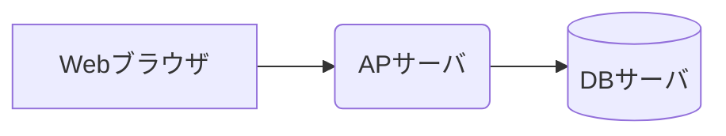
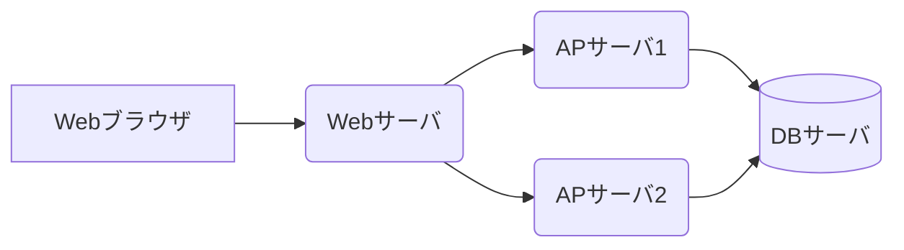

Webサービスを提供するサーバは、規模が大きくなるほど複数のサーバを使って構成するようになります。
Webサービスでは、以下の種類のサーバが存在します。

- Webサーバ :
    - 静的なコンテンツ (HTMLやJavaScriptなど) を配信する
    - それ以外のクライアントからのHTTPリクエストはAPサーバに転送する
    - 例：Apache, Nginx, IIS
- APサーバ :
    - 動的なコンテンツ（リクエストに応じて変化する内容）を生成する
- DBサーバ :
    - サービスに必要なデータを管理する
    - APサーバからの要求に応じてデータを保存・提供する
    - 例：SQL Server, PostgreSQL

### 1台構成

一つのサーバ内にWebとAPとDBの複数のサービスをインストールして稼働環境を構築するパターンです。
開発環境などで利用するパターンですが、小規模なサービスやユーザ数の少ないサービスでは、最もコストがかからない構成です。
インターネットに公開しないで社内LANの中で閉じているサービスを作るときによく使われます。

### 2層構造

APサーバとDBサーバを分離して構築するパターンです。
複数のWebサービスが同じDBを共有するShared Databaseパターンを実現することができ、マルチテナントによるコスト削減ができます。

### 3層構造

スケールアウトを実現するために、APサーバの前段にWebサーバを配置するパターンです。
ロードバランサによって負荷分散を実現する方法で、具体的にはWebサーバにNginxを使ってロードバランサする方法や、AWSなどのCSPが提供するElastic Load Balancingを使う方法などがあります。
大量の処理を扱うサービスで利用状況に応じてスケールアウトする必要がある場合に、このパターンが使われます。

以上です。
