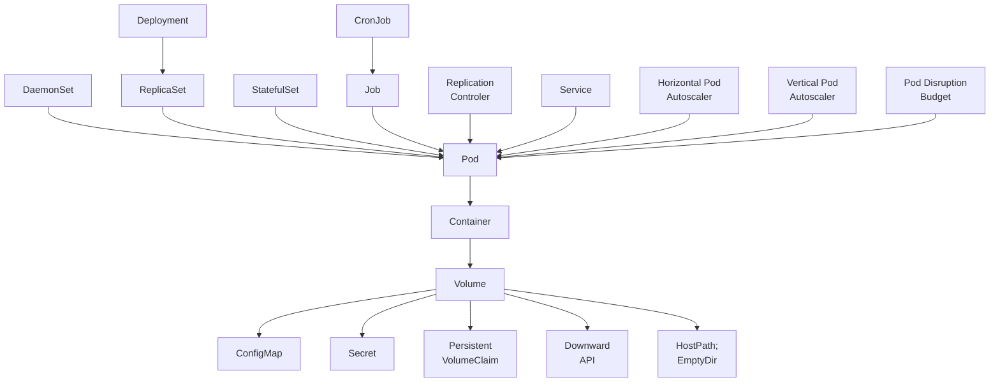

### 構成要素の比較

C#プログラミングと分散アプリケーションの設計・実装の比較

| 手法 | プログラミング | 分散アプリ
|:---|:---|:---|
| 振る舞いのカプセル化 | クラス | コンテナイメージ
| 振る舞いのインスタンス | オブジェクト | **コンテナ**
| 再利用の単位 | dll | コンテナイメージ
| コンポジション | メンバ変数にインスタンスを格納 | Sidecarパターン
| 継承 | 親クラスの継承 | FROMで別コンテナの利用
| デプロイの単位 | binフォルダ | **Pod**
| ビルドやランタイムの分離方法 | モジュール、パッケージ、クラス | Namespace, Pod, コンテナ
| 初期化時の処理 | コンストラクタ | Initコンテナ
| 初期化後のトリガ | Initメソッド | postStart
| 削除前のトリガ | Destroyメソッド | preStop
| 後片付け処理 | finalizer | -
| 非同期処理 | async/await | Job
| 定期的な処理 | Timer | CronJob
| バックグラウンド処理 | サービス | DaemonSet
| 設定管理 | IConfiguration | ConfigMap, Secret


Kubernetesの構成要素の関係性



### コンテナ

コンテナはKubernetesの構成要素の1つです。
OOPのプログラミングと比較するなら、コンテナイメージはクラスのようなもので、コンテナはオブジェクトのようなものと言えます。

- コンテナイメージは単一の問題を解決するための機能の単位です。
- コンテナは通常1つのLinuxプロセスとして動作します。
- コンテナは容易に破棄することができ、いつでも安全にスケールアップ・スケールダウンできます。

### Pod

Podは1つ以上のコンテナから構成された、Kubernetesで実行できるワークロードの最小単位です。

- 1つのPodには複数のコンテナを配置することができます。
- Pod内のコンテナはネットワークやストレージ、CPUやメモリなどのリソースを共有します。つまり、Podはコンテナを同じホストに置くことを保証します。
- Pod内のコンテナはそれぞれ個別のIPを持たず、Podが持っているIPを共有します。
- Pod内のコンテナ間の通信は、localhostとポート番号で名前解決することができます。

Podの作成にはいくつかの方法があります。

- 長期にわたって動作するプロセス
    - **ベアPod** : コンテナを動かすために手動でPodを作成できます。ただし、この方法で作成したPodは障害発生時に自動で再起動されません。開発やテスト目的でのみ使用されます。
    - **ReplicaSet** : 継続的に動作することが期待されるPodのライフサイクルを作成し、管理するために使われます。
    - **DaemonSet** : 全てのNodeで1つのPodのコピーが稼働することを保証します。監視、ログ収集、ストレージコンテナなどのプラットフォームの機能を管理するのに使われます。
    - **StatefulSet** : ステートフルなアプリケーションを管理するのに適しています。他とは異なり、安定的なネットワークIDと永続ストレージを持っています。
- 短命のプロセス
    - **Job** : Podが正常終了することを追跡することが目的で、バッチ処理の実行などのユースケースで利用されます。
    - **CronJob** : Linuxのcrontab (cron table) のように、Jobを指定した時刻に定期的に実行できます。

### Service

KubernetesのServiceは、Podをネットワークに公開するための方法を提供する抽象的な概念です。
Podは、動作しているノードが正常でなくなると、違うノードに移行されることもあります。
つまり、Pod のネットワークアドレスはアプリケーションが稼働中に変わり得るということです。
その変化に対する名前解決とロードバランシングを行う仕組みが Service です。

### Label

複数のPodから構成されるシステムにおいて、どのPodがどのシステムを構成しているのかの区別するために Label という仕組みがあります。
Labelを使うことで分散アプリケーションの一部をグループ化してサブシステムとして見なすことができます。

- Labelは、Podの集合を論理的にグループ化します。
- ReplicaSet は、特定のPodのインスタンスが動き続けるようにするためにLabelを使用します。
- スケジューラはPodの要求を満たすノードにPodを配置したり分散したりするためにLabelを使用します。
- Kubernetesの仕組み以外でも、Labelを使ってビジネス上の特性や重要度などのメタ情報をLabelに記載しておくと、システム全体を歩くときに役に立ちます。

### Namespace

KubernetesのNamespaceを使うことで、複数のホストにまたがっているKubernetesクラスタをリソースの論理的なプールに分けられるようになります。
Namespaceは、Kubernetesリソースに対するスコープと、クラスタの一部に対して認証やその他のポリシーを適用する仕組みを提供します。

- KubernetesのNamespaceは、技術的にはLinuxのNamespaceを利用しています。LinuxのNamespaceも同様に、プロセスをグループ化してコンテナの隔離された空間を作り出すための機能を提供しています。
- Kubernetesの各 Service は、1つのNamespaceに所属し、`<service-name>.<namespace-name>.svc.cluster.local` のような Namespace が含まれるDNSレコードが割り当てられます。

以上です。
