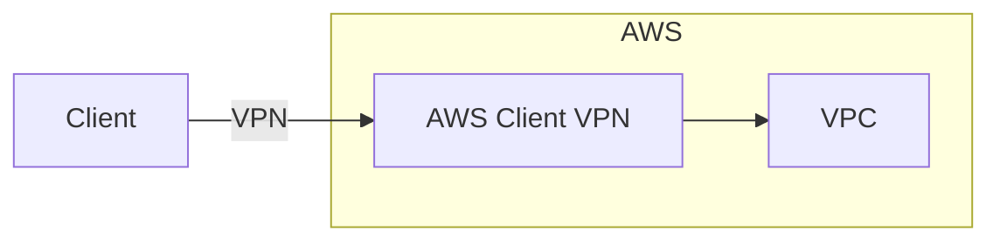
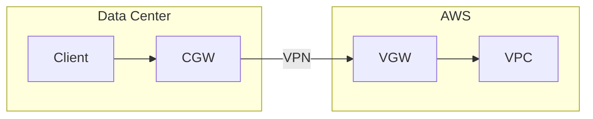
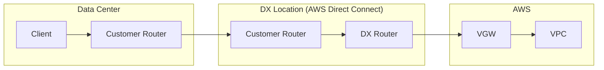
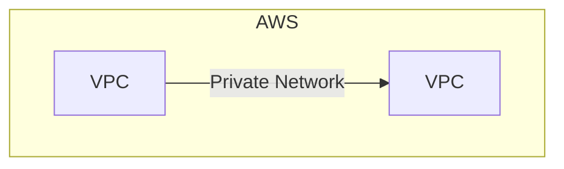
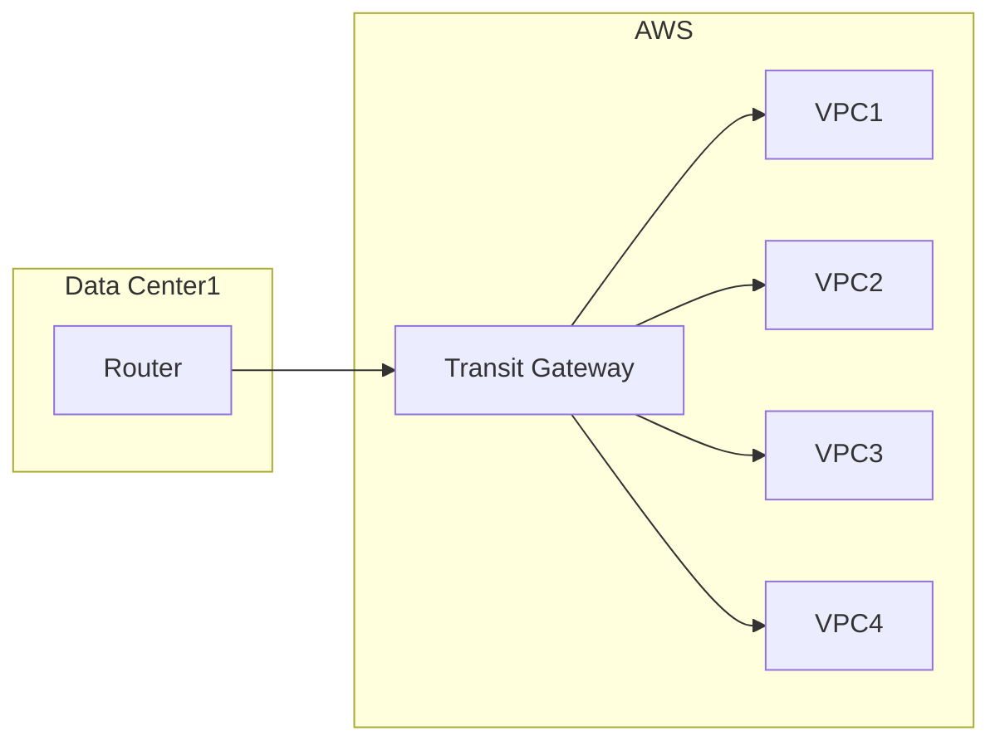

# 1. AWS SAP

AWS Certified Solutions Architect - Professional (SAP-C02)

- AWS Well-Architectedフレームワークに基づいてAWSソリューションを設計し、最適化することを課題とし、受験者の高度な技術スキルと経験を検証するための試験
- AWS Well-Architectedフレームワークの範囲内で以下のタスクを解決するための能力が求められる
    - 複雑な組織に対応する設計（採点対象の26%）
    - 新しいソリューションのための設計（採点対象の29%）
    - 既存ソリューションの継続的な改善（採点対象の25%）
    - ワークロードの移行とモダナイゼーションの加速（採点対象の20%）

### 試験内容

- 試験期間 : 180 分
- 試験形態 : 75 個の問題 (複数選択または複数応答のいずれか)
    - スコアに影響する設問が 65 問含まれています。
    - スコアに影響しない採点対象外の設問が 10 問含まれています（パフォーマンス情報の収集のため）

試験の結果：

- 試験の結果は、100～1000 の換算スコアとして報告されます。合格スコアは 750 です。
    - 複数の試験間で難易度がわずかに異なる可能性があるため、スコアを均等化するために換算スコアが使用されます。

### 対象スキル

#### 1: 複雑な組織に対応する設計

- 1.1: ネットワーク接続戦略を設計する。
    - 複数のVPCの接続オプションを評価する（Direct Connect, AWS VPN）
    - オンプレミス、コロケーション、クラウド統合の接続オプションを評価する（ハイブリッドDNS）
    - ネットワークとレイテンシーの要件に基づいて AWS リージョンとアベイラビリティーゾーンを選択する
    - AWSツールを使用してトラフィックフローの問題を解決する（VPC Flow Logs）
    - サービス統合のためのサービスエンドポイントを使用する
- 1.2: セキュリティコントロールを規定する。
    - クロスアカウントアクセス管理を評価する（IAM）
    - サードパーティーIDプロバイダーと統合する（API Gateway, Cognito）
    - 保存中のデータと転送中のデータに対する暗号化戦略をデプロイする（AWS KMS, ACM）
    - セキュリティイベントの通知と監査を一元化するための戦略を策定する（CloudTrail, IAM Access Analyzer, AWS Security Hub, Amazon Inspector）
- 1.3: 信頼性と耐障害性に優れたアーキテクチャを設計する。
    - RTOおよびRPO要件に基づいて災害復旧ソリューションを設計する（パイロットライト, ウォームスタンバイ、マルチサイト）
    - 障害から自動的に復旧するアーキテクチャを実装する（AWS Elastic Disaster Recovery）
    - スケールアップとスケールアウトのオプションを考慮し、最適なアーキテクチャを策定する
    - 効果的なバックアップ/復元の戦略を設計する
- 1.4: マルチアカウントAWS環境を設計する。
    - 組織の要件に最も適したアカウント構造を評価する（AWS Organizations）
    - 一元的なログ記録とイベント通知の戦略を推奨する
    - マルチアカウントガバナンスモデルを開発する（AWS Control Tower）
- 1.5: コスト最適化と可視化の戦略を決定する。
    - AWSツールでコストと使用量をモニタリングする（AWS Trusted Advisor, AWS料金見積りツール, AWS Cost Explorer, AWS Budgets, AWS Compute Optimizor, S3 Storage Lens）
    - コストを事業単位にマッピングする効果的なタグ付け戦略を策定する（AWS Organizations - SCP）
    - 購入オプションがコストとパフォーマンスに与える影響を理解する（リサーブドインスタンス, Savings Plans, スポットインスタンス）

#### 2: 新しいソリューションのための設計

- 2.1: ビジネス要件を満たすデプロイ戦略を設計する。
    - 新しいサービスや機能のためのアプリケーションまたはアップグレードパスを決定する（CloudFormation）
    - デプロイ戦略を策定し、適切なロールバックメカニズムを実装するためのサービスを選定する（CI/CD）
    - 必要に応じてマネージドサービスを採用し、インフラストラクチャのプロビジョニングやパッチ適用のオーバーヘッドを削減する（AWS System Manager）
- 2.2: 事業の継続性を確保するソリューションを設計する。
    - 災害復旧ソリューションを構成する
    - データとデータベースのレプリケーションを構成する
    - 災害復旧テストを実行する
    - 自動化され、費用対効果が高く、複数のアベイラビリティーゾーンまたはAWS リージョンをまたいで事業継続性をサポートするバックアップソリューションのアーキテクチャを設計する
    - 障害時もアプリケーションとインフラストラクチャの可用性を維持するアーキテクチャを設計する
    - プロセスとコンポーネントを使用して一元的なモニタリングを行い、システム障害からプロアクティブに復旧する
- 2.3: 要件に基づいてセキュリティコントロールを決定する。
    - 最小権限アクセスの原則に従ったIAMユーザーとIAMロールを指定する（IAM）
    - セキュリティグループルールとネットワークACLルールを使用したインバウンドおよびアウトバウンドのネットワークフローを指定する（ルートテーブル, セキュリティグループ, ネットワークACL）
    - 大規模なウェブアプリケーションの攻撃対策戦略を策定する（AWS Shield, AWS WAF, GuardDuty, AWS Security Hub）
    - 保管中のデータと転送中のデータの暗号化戦略を策定する。
    - サービス統合のサービスエンドポイントを指定する。
    - 組織の規格への準拠を維持するためのパッチ管理戦略を策定する（AWS System Manager）
- 2.4: 信頼性の要件を満たす戦略を策定する。
    - ビジネス要件に基づいて可用性の高いアプリケーション環境を設計する
    - 高度な技術を使用して障害に備えて設計し、シームレスなシステム回復性を確保する
    - 疎結合依存関係を実装する（SNS, SQS, Step Functions）
    - 高可用性アーキテクチャを運用、保守する (アプリケーションのフェイルオーバー、データベースのフェイルオーバー)
    - AWSマネージドサービスを使用して高可用性を実現する（S3, RDS, ElastiCache）
    - DNSルーティングポリシーを実装する (Route 53 のレイテンシールーティングポリシー、位置情報ルーティング、シンプルルーティング)
- 2.5: パフォーマンス目標を満たすソリューションを設計する。
    - さまざまなアクセスパターンに対応した大規模アプリケーションアーキテクチャを設計する
    - ビジネス目標に合わせて伸縮自在なアーキテクチャを設計する
    - キャッシュ、バッファリング、レプリカでパフォーマンス目標を達成するための設計パターンを適用する
    - 必要なタスクに特化したサービスを選択するためのプロセス方法論を策定する
    - サイズ適正化戦略を設計する
- 2.6: ソリューションの目標と目的を達成するためのコスト最適化戦略を決定する。
    - インフラストラクチャを選択し適切なサイズにする機会を特定して、リソースの費用対効果を上げる。
    - 適切な価格モデルを特定する（リザーブドインスタンス, Savings Plans）
    - データ転送のモデル化とサービスの選択を行い、データ転送コストを削減する
    - 経費支出と使用状況を認識するための戦略を策定し、制御を実装する（Cost Explorer, Trusted Advisor, AWS料金見積りツール）

#### 3: 既存ソリューションの継続的な改善

- 3.1: 全体的な運用上の優秀性を高めるための戦略を作成する。
    - 最も適したログ記録とモニタリング戦略を決定する (CloudWatch)
    - 改善の機会を特定する目的で現在のデプロイプロセスを評価する (CI/CD, Blue/Green Deploy, ローリングアップデート)
    - ソリューションスタック内のオートメーションの機会に優先順位を付ける
    - 構成管理オートメーションを可能にするために適切なAWSソリューションを提案する（Systems Manager）
    - 復旧アクションの理解をサポートし、演習するための障害シナリオアクティビティを設計する
- 3.2: セキュリティを向上させるための戦略を決定する。
    - シークレットと認証情報を安全に管理するための戦略を評価する（AWS Config, Secrets Manager）
    - 最小権限アクセスについて環境を監査する
    - 実装されたソリューションを見直し、すべてのレイヤーでセキュリティを確保する
    - ユーザーとサービスの包括的なトレーサビリティを見直す
    - 脆弱性の検出に対する自動対応に優先順位を付ける
    - パッチと更新のプロセスを設計し、実装する（Systems Manager）
    - バックアッププロセスを設計し、実装する
    - 修復手法を採用する
- 3.3: パフォーマンスを改善するための戦略を決定する。
    - ビジネス要件を測定可能なメトリクスに変換する（SLA, KPI）
    - 修復ソリューション候補をテストし、レコメンデーションを行う（プレイスメントグループ）
    - 新しいテクノロジーとマネージドサービスを導入する機会を提案する（Global Accelerator, CloudFront）
    - ソリューションを評価し、要件に基づいてサイズの適正化を行う（オートスケーリング, EC2フリート）
    - パフォーマンスのボトルネックを特定し、調査する（CloudWatch）
- 3.4: 信頼性を向上させるための戦略を決定する。
    - アプリケーションの利用増加と使用傾向を把握する。
    - 既存のアーキテクチャを評価し、信頼性が不十分な領域を特定する。
    - 単一障害点を修正する。
    - データレプリケーション、自己修復、伸縮自在な機能とサービスを実現する。
- 3.5: コスト最適化の機会を特定する。
    - 使用状況レポートを分析し、使用率の低いリソースと使用率の高いリソースを特定する。
    - AWS ソリューションを使用し、使用されていないリソースを特定する（リソースのサイズ適正化）
    - 予想される使用パターンに基づいて課金アラームを設計する。
    - AWS Cost and Usage Report をきめ細かく調査する。
    - コスト配分とレポート作成にタグ付けを使用する。

#### 4: ワークロードの移行とモダナイゼーションの加速

- 4.1: 移行が可能な既存のワークロードとプロセスを選択する。
    - アプリケーション移行アセスメントを実施する (AWS Migration Hub)
    - 7つの一般的な移行戦略 (7R) に従ってアプリケーションを評価する
    - 総保有コスト (TCO) を評価する
- 4.2: 既存ワークロードの最適な移行アプローチを決定する。
    - 適切なデータベース転送メカニズムを選択する（AWS Database Migration Service (AWS DMS)、AWS Schema Conversion Tool (AWS SCT)）
    - 適切なアプリケーション転送メカニズムを選択する（AWS Application Discovery Service、AWS Application Migration Service）
    - 適切なデータ転送サービスと移行戦略を選択する（AWS DataSync、AWS Transfer Family、AWS Snow Family、S3 Transfer Acceleration, Direct Connect、AWS　Site-to-Site VPN、Route 53 など）
    - 移行ツールに適したセキュリティ方法を適用する（IAM Identity Center、AWS Directory Service）
    - 適切なガバナンスモデルを選択する (AWS Control Tower、Organizations)
- 4.3: 既存ワークロードの新しいアーキテクチャを決定する。
    - 適切なコンピューティングプラットフォームを選択する (Amazon EC2, AWS Elastic Beanstalk)
    - 適切なコンテナホスティングプラットフォームを選択する (Amazon ECS, Amazon EKS, AWS Fargate, Amazon ECR)
    - 適切なストレージサービスを選択する (EBS, EFS, FSx, S3, ボリュームゲートウェイ)
    - 適切なデータベースプラットフォームを選択する (DynamoDB, OpenSearch Service, RDS, EC2上のセルフマネージド型DB)
- 4.4: モダナイゼーションと機能強化の機会を決定する。
    - アプリケーションコンポーネントを切り離す機会を特定する
    - サーバーレスソリューションの機会を特定する (AWS Lambda)
    - コンテナに適したサービスを選択する (Amazon ECS, Amazon EKS, Fargate)
    - 目的別データベースの機会を特定する (DynamoDB, Amazon Aurora Serverless、ElastiCache)
    - 適切なアプリケーション統合サービスを選択する (Amazon SQS、Amazon SNS, Amazon EventBridge, Step Functions)

資料：[AWS SAP-C02 試験ガイド](https://d1.awsstatic.com/ja_JP/training-and-certification/docs-sa-pro/AWS-Certified-Solutions-Architect-Professional_Exam-Guide.pdf)

 

# 2. 複雑な組織への対応

組織でAWSを利用する場合は、複数のAWSアカウントを使用することになる。
それにより、認証、ネットワーク、ログ、運用などが複雑になる。

## 2-1. 組織のネットワーク設計

### VPCエンドポイント

VPCエンドポイントを使用することで、プライベートネットワーク接続でAWSサービスにアクセスすることができる。

AWSサービスのAPIエンドポイントは、パブリックネットワークに存在する。
そのため、VPN内で起動するEC2インスタンスからリクエストを送信するためには以下の操作が必要になる。

- インターネットゲートウェイがアタッチされたVPCのパブリックサブネットでEC2を起動する
- インターネットゲートウェイがアタッチされ、NATゲートウェイが起動しているVPCのプライベートサブネットでEC2を起動する
- VPCエンドポイントを設定する
    - **ゲートウェイエンドポイント** : VPCのサービス専用のゲートウェイ（S3とDynamoDBのみ対応）
        - 利用料金は発生しない
    - **インターフェイスエンドポイント** : VPCのサブネットにENI (Elastic Network Interface) を作成し、ENIに割り当てられたプライベートIPアドレスを経由してサービスにアクセスする。
        - 利用料金が発生する
        - インターフェイスエンドポイントが作成されるとDNS名が発行される。
        - AWS PrivateLinkで、ENIとサービスの間をプライベート接続できる。
        - AWS **PrivateLink**の通信先にサードパーティサービスのNetwork Load Balancerを指定することで、第三者のサービスを利用することができる
        - S3インタフェースインドポイントは、プロキシサーバが必要なくオンプレミスからS3を使用できる。

### AWSクライアントVPN

AWSクライアントVPNを使用することで、オンプレミスクライアントからVPCにVPN接続できる。

AWSクライアントVPNは、OpenVPNベースのVPNクライアントを利用したクライアントからVPCへアクセスできる。
AWSクライアントVPNでは以下の3つのタイプの認証が使用できる。

- Active Directory認証 :
    - AWS Managed Microsoft AD または AD Connector を使用する
- シングルサインオン (SAML) :
    - IAM SAML IDプロバイダを作成する
- TLS相互認証 (mTLS) :
    - AWS Certificate Managerにクライアント証明書をアップロードして使用する

AWSクライアントVPNの接続ログや接続ハンドラ設定ができる。ハンドラによりLambda関数で任意の接続許可・拒否ロジックを実装できる。

### AWS Site-to-Site VPN

VPCに仮想プライベートゲートウェイをアタッチし、データセンターなどのオンプレのルータと、IPsecによるVPN接続が可能です。

- 仮想プライベートゲートウェイ
    - VPC側の設定。ASN (自律システム番号) を指定できる。デフォルトは Amazon のASN (64512) が使用される
- カスタマーゲートウェイ
    - オンプレ側のルータの設定。動的ルーティングではBGPのASNの指定ができる。パブリックなASNがないときはプライベートASN (64512〜65534) を指定できる。
    - 証明書ベースで認証するときは、AWS Certificate Managerにプライベート証明書を事前にインポートして指定する
    - 事前共有キーで認証するときは、インターネット側からアクセス可能なIPを持つルータが必要
    - ルータがBGP対応のときは動的ルーティングを選択し、BGP未対応のときは静的ルーティングを選択して設定する

仮想プライベートゲートウェイとカスタマーゲートウェイ間のVPN接続は以下がサポートされています。

- IKEv2
- NATトラバーサル
- デッドピア検出 : 接続先のデバイスが有効かどうかを確認する

VPN接続を作成すると、仮想プライベートゲートウェイは2つのAZにそれぞれトンネルを作成します。
それぞれのトンネルはパブリックなIPアドレスが割り振られており、障害時はもう一方へ自動ルーティングされることで冗長性を維持します。
トンネルエンドポイントの置換が発生すると AWS Personal Health Dashboard に通知が送信されます。

### AWS Direct Connect (DX)

AWS Direct Connectは、ユーザまたはパートナーのルーター (Customer Router) から Direct Connect のルーター (DX Router) に、標準のイーサネット光ファイバーケーブルを介して接続するサービスです。

- Direct Connectには専用接続（1Gbps以上）とホスト接続（500Mbps）がある。
- Direct Connectの回復性レベルでは「最大回復性」「高い回復性」「開発とテスト」の3段階が用意されている。
    - 最大回復性 : 複数のロケーションで冗長構成。1ロケーション内に複数のカスタマールータ、DXルータによる冗長構成
    - 高い回復性 : 複数のロケーションで冗長構成。1ロケーション内に単一のカスタマールータ、DXルータのみ
    - 開発とテスト : 単一のロケーション。1ロケーション内に複数のカスタマールータ、DXルータによる冗長構成
- 仮想インターフェイスには以下の種類がある：
    - プライベート仮想インターフェイス : プライベートIPを使用して、Amazon VPCにアクセスできる
    - パブリック仮想インターフェイス : パブリックなAWSサービス（S3、DynamoDB）にアクセスできる
    - トランジット仮想インターフェイス : Transit Gatewayにアクセスできる
- LAG (Link Aggregation Group) は、複数の専用接続を集約して1つの接続として扱えるようにする論理インターフェイス
- Direct Connect Gateway : 
    - 「仮想プライベートゲートウェイ (VGW)」と「プライベート仮想インターフェイス (VIF)」をグループ化する機能
    - 各地域間の通信のレイテンシーを改善するためにも利用できる

Direct Connectの料金：

- ポート時間 :
    - 容量（1Gbps、10Gbps、100Gbps、1Gbps未満）と接続タイプ（専用接続、ホスト接続）によって決まる
    - 接続が作成されてから90日後 or 90日前だがDirect Connectエンドポイントとカスタマールーターの接続が確立されたときから課金が始まる
- データ転送 : 
    - プライベートVIFのときは、データ転送を行うAWSアカウントに対して課金される
    - パブリックVIFのときは、データを持つリソース所有者に対して課金される
        - パブリックVIFを作ることで、オンプレミスのデータセンターがAWSパブリックサービスにアクセスできる

### VPCピア接続

VPCピア接続を使用することで、VPCが他のVPCとの接続をプライベートネットワークで行うことができる。

ピア接続作成後は、サブネットに関連付いているルートテーブルにピア接続をターゲットとする送信先ルートを作成する必要がある。

### AWS Transit Gateway

AWS Transit Gatewayは、最大5000のVPCやオンプレ環境の接続を簡素化するためのサービス。

仮想プライベートゲートウェイの代わりに、Transit Gatewayとカスタマーゲートウェイ間でVPN接続を作成できる。
Transite Gatewayのピアリング接続（ピア接続）を使用すると、異なるリージョン間でTransite Gatewayを介した接続ができる。

- VPCアタッチメント
- VPN接続 : Transit Gatewayに対してオンプレミスのルーターなどのカスタマーゲートウェイとVPN接続ができる
- Direct Connectトランジット仮想インターフェイス
- Transit Gatewayピアリング接続
- Transit Gateway Network Manager : Transit Gatewayを登録すると、ネットワークの視覚化、モニタリングができる。
- Global Accelerator連携でVPNを高速化できる

### Route53

Amazon Route 53 はDNSサービスで、世界中からのDNSクエリに応答できるほか、プライベートホストゾーンでVPCのDNSとして使用できる。

- Route 53 プライベートホストゾーン
    - ホストゾーンはプライベートでも作成できます。プライベートホストゾーンを作成すると、VPC内のDNSとして名前解決するサービスを提供します。
- Route 53 Resolver
    - DNSリゾルバとしての機能を提供します。

その他：

- 複数値回答ルーティングポリシー : 各リソースが正常かどうかも確認し、正常なリソースの値のみを返す。ロードバランシングを向上させる方法
- 加重ルーティングポリシー : トラフィックの分配に使用される
- フェイルオーバールーティングポリシー : 「ターゲットのヘルスを評価」を有効化することで、プライマリリージョンで障害が発生した時に自動的にフェイルオーバーリージョンに切り替えることができる

 

## 2-2. マルチアカウント

### クロスアカウントアクセス

- 複数アカウントではIAMロールによるクロスアカウントアクセスを使用することでIAMユーザーの一元管理ができる
- IAMユーザは、アカウントIDとIAMロールを指定して、スイッチロールします。
スイッチロールするときに、AWS STS (Security Token Service) のAssume Roleアクションによって、IAMロールから一時的認証情報を取得します。
これにより、クロスアカウントアクセスができるようになります。
AWS CLIでは `aws sts` コマンドを使用して、クロスアカウントアクセスを行います。

### カスタムIDブローカーアプリケーション

クロスアカウントだけではなく、オンプレミスのアプリケーションからも同様にSDKにより開発したプログラムで、IAMロールにリクエストを実行することもできる。

### サードパーティ製品へのアクセス許可

- 混乱した代理問題 : サードパーティ製品にIAMロールARNを登録する。サードパーティ製品は、sts:AssumeRoleによってユーザの権限を一時的に付与されることでサービスを提供できる。ただし、この方法だとIAMロールARNが漏洩すると不正利用される可能性がある
- 解決策 : 外部IDを使用する。サードパーティ製品にIAMロールARNを登録するときに、サードパーティ側からランダムな外部IDを払い出す。ユーザはIAMロールの信頼ポリシーのConditionでsts:ExternalIdとして外部IDを指定し、その外部IDを持つアカウントからのsts:AssumeRoleのみが許可されるようにする。

### AWS Directory Service

Windowsサーバの認証に、Active Directoryを使用するには、以下のいずれかを使用します。

- AD Connector
    - オンプレのActive Directoryに連携するためのサービス
- Simple AD
    - 機能が制限されたActive Directory
    - 最大5000ユーザまで、かつ他のドメインとの信頼関係やMFAが必要ない場合に選択できる
- AWS Directory Service for Microsoft Active Directory (AWS Managed Microsoft AD)
    - Microsoft Active Directoryのマネージドサービス

### IAMアイデンティティセンター

AWS SSOの後継で、複数のAWSアカウントと外部アプリケーションへのシングルサインオンを実現するためのサービスです。

- IAMアンデンティティセンターのIDソースにActive Directoryや外部IDプロバイダーを設定できる

### AWS Organizations

AWS Organizationsを利用しないと、複数のアカウント作成時に毎回クレジットカードと電話番号の登録が発生したり、各アカウントのIAMロールのポリシー設定が重複して発生してしまいます。
AWS Organizationsでは、Organizations APIによるアカウント作成の自動化や、SCP (サービスコントロールポリシー) による組織単位 (OU) のポリシーが設定できます。

**SCP**（サービスコントロールポリシー）とは、Organizations組織でOU（組織単位; Organization Unit）やアカウントに設定するポリシーです。
OUに適用したSCPのポリシーは、その下の全ての階層に継承されます。

- 拒否戦略ポリシーでは、例外IAMロールを設定された権限のフィルタリングが可能
- 拒否戦略ポリシーで、Organizationsから外れることを制限したり、指定タグのないリソース作成を制限することができる
- 一括請求により、請求書が1つなる。さらにボリュームディスカウント、RI、Savings Plansの共有によるコスト最適化が可能になる
- OUには継承以外に1つ以上のSCPを直接アタッチする必要がある
- SCPを使用するには、Organiztionsで全ての機能を有効にする必要がある
- SCPではDenyルールのみ指定できる

AWS Organizationsには2つの利用可能な機能セットがある：

- すべての機能：デフォルトで有効化されている機能。一括請求機能も含む
- 一括請求機能：組織内のアカウント管理を一元化するための管理ツールが提供される

#### AWS CloudFormation StackSets

AWS CloudFormation StackSetsは、複数リージョン、複数アカウントにスタックを作成して、変更・削除・管理できる機能です。
Organizationsと統合することで、組織、OU、アカウントを指定して、スタックを作成・変更・削除できます。

#### AWS Service Catalog

- AWS Service Catalogは、IAMユーザにCloudFormationスタックで作成されるリソースへの直接的なアクセス権限を与えずに、IAMユーザは事前に用意されたテンプレートからスタックを作成することができます。
- AWS Service Catalogを使用することで、ユーザーの権限はService Catalogのポートフォリオ製品の利用権限だけとなる。
- IAMユーザに必要なサービスリソースを自分自身で作成できるようにしながら、余計な操作をさせないように制限することができる（最小権限にできる）。

#### AWS Resource Access Manager (RAM)

AWS Resource Access Managerは、Organizationsと連携して、リソースへのアクセス管理を組織、OUの中で共有できます。
例えば、Transit Gateway、サブネット、Route 53 Resolverの転送ルールなどを複数のアカウントで共有できます。

#### AWS Control Tower

AWS Control Towerは複数アカウントのベストプラクティスであるランディングゾーンを自動構築する。

- ランディングゾーンは、事前に定義済みのアカウント構造、ネットワーク構造、請求の枠組み、ログの記録などの必要最低限の設定をしたベースラインのこと

Control Towerは、マルチアカウントの組織におけるベストプラクティスを自動で簡単に構築できるOrganizationsと連携したサービス。

- 予防コントロール : 
- 検出コントロール : すでに使用中のAWSリソースについてガイドライン違反を検出する
- ログ集約アカウント
- 監査アカウント
- AWS IAMアイデンティティセンター連携

 

# 3. ソリューション設計と継続的改善

新規構築時の要件と、既存の設計を継続的に改善するための設計において

## 3-1. 運用

デプロイ関連サービス

- **AWS CodeCommit** :
    - CodeCommitは、プライベートなGitレポジトリをAWS上で提供するサービスです。
- **AWS CodeBuild** :
    - CodeBuildは、ビルドとテストを実行するコンテナ環境をフルマネージドで提供するサービスです。
    - 作成したパッケージ（アーティファクト）は、指定したS3バケットにアップロードされたり、buildspec.ymlに定義したECRレポジトリに保存されます。
- **AWS CodeDeploy** :
    - CodeDeployは、EC2インスタンスやECSコンテナ、Lambda関数、オンプレサーバなどへのデプロイを自動化するサービスです。
- **AWS CodePipeline** :
    - CodePipelineはソース、ビルド、デプロイのCI/CDパイプラインを自動化するためのサービスです。
    - SAM (Serverless Application Model) の継続的なCI/CDパイプラインを構築できる。

#### AWS CodeDeploy

CodeDeployは、EC2インスタンスやECSコンテナ、Lambda関数、オンプレサーバなどへのデプロイを自動化するサービスです。
デプロイ仕様のAppSpecのYAML (appspec.yml) を定義して、デプロイを実行します。

- デプロイグループには、デプロイする条件を定義した「デプロイ設定」を割り当てる
    - EC2 :
        - CodeDeployDefault.OneAtTime（一度に1つのインスタンスにのみデプロイ）
        - CodeDeployDefault.HalfAtTime（一度に全体の半分のインスタンスにデプロイ）
        - CodeDeployDefault.AllAtOnce（一度に全てのインスタンスにデプロイ）
    - ECSやLambda :
        - CodeDeployDefault.ECSLinear10PercentEvery1Minutes（1分ごとにトラフィックの10%を新ECSコンテナへ移行する）
        - CodeDeployDefault.ECSCanary10Percent15Minutes（最初のトラフィックの10%を、15分後に残りの90%を新ECSコンテナへ移行する）
- 利用できるデプロイ戦略
    - EC2 :
        - **In-place** : 新しいアプリケーションを置き換えていく戦略
        - **Blue/Green** : 新しいアプリケーションのテスト完了後にトラフィックを新しいノードへ切り替える戦略
    - ECSやLambda :
        - **Canary** : 最初のトラフィックのN%を新しいノードに切り替え、しばらくした後に残りのトラフィックを新しいノードに切り替える
        - **Linear** : 一定間隔ごとにトラフィックを新しいノードへ切り替える戦略

#### AWS CloudFormation

**CloudFormation**とは、YAML形式で記述されたテンプレートテキストから、AWS上のリソース環境を構築できるサービスです。

- コストを最適化するためには、必要なときに環境構築をし、終了したら破棄する
- **スタック** (Stack) : CloudFormationによって構築されたリソースの集合
- CloudFormationには以下の機能が含まれている :
    - **カスタムリソース** : 任意のLambda関数を実行できる
    - CloudFormationヘルパースクリプト : Amazon Linux AMIなどのEC2インスタンスの /opt/aws/bin 内に便利なコメント群が含まれている
    - **スタックポリシー** : 意図しない更新を防ぐことができる（スタック更新時のリソース保護ができる）
    - **DeletionPolicy**（削除ポリシー） : スタック削除時に特定のリソースを保護できる
    - AWS CDK : ソースコードからCloudFormationテンプレートを生成できる
- SAM (Serverless Application Model) :
    - CloudFormationの拡張で、サーバーレスアプリケーションアーキテクチャ（Lambda, API Gateway, DynamoDB, S3など）の構築を高速化するため

#### AWS Elastic Beanstalk

Elastic Beanstalkは、開発者が素早くAWSを使い始めることができるようにするサービスです。
典型的なシステム構成やインフラストラクチャ設定をオプションの中から選択して、自動的にアプリケーション環境を構築するサービスです。

- Elastic Beanstalkの .ebextensions により、OSのカスタマイズセットアップが可能
- Elastic Beanstalkではローリングデプロイにより、指定したバッチサイズごとのデプロイを実現できる
- Elastic Beanstalkでは、クローン、デプロイ、スワップによるブルー・グリーンデプロイが可能
- Elastic Beanstalkは、主要なアプリケーションプラットフォーム（Java、.NET、PHP、Node.js、Python、Ruby、Go、Dockerなど）に対応
- Elastic Beanstalkは、主要なWebサーバ（Apache、NGINX、Passenger、IISなど）に対応

### デプロイメントパターン

- ローリングデプロイ : 指定したバッチサイズ（インスタンス数や割合）ずつ更新デプロイをする方法
- ブルー・グリーンデプロイ : 現在のバージョンをブルー、新しいバージョンをグリーンとしてデプロイし、リクエストの送信先をブルーからグリーンに切り替える方法
    - Route53の加重ルーティングによるBlue/Greenデプロイ
    - ALB (Application Load Balancer) を使用したBlue/Greenデプロイ
    - EC2 Auto Scalingを使用したBlue/Greenデプロイ

### モニタリング

#### AWS Healthイベント

AWS Healthイベントでは、AWSアカウントに影響を及ぼすイベント（機能変更や障害など）をモニタリングできます。
- 提供される情報 :
    - アカウント固有のイベント（使用中のリソースに関するもの）
    - パブリックイベント（使用していないサービスも含む）
- イベント情報には以下のサービスからアクセス可能 :
    - Personal Health Dashboard : 自分のアカウントで利用しているインスタンスなどの情報を取得できる
    - Service Health Dashboard : マネジメントコンソールにアクセスしなくても情報を取得できる
    - AWS Health API
- EventBridgeと連携してHealthイベントに対するアクションを自動化できる

#### Amazon CloudWatch

- メトリクス、ダッシュボード :
    - クロスアカウントオブザーバビリティによって複数アカウントにまたがった共有が可能
- アラーム :
    - 複合アラーム（AND, OR, NOT）を複数個設定できる
- 異常検知 :
    - 機械学習で正常ベースラインが計算される。異常値になったときにCloudWatchアラームを発火できる
- CloudWatch Logs :
    - CloudWatch Logsインサイトでクエリによるインタラクティブな分析が可能
    - 機密情報を自動でマスク保護できる
- CloudWatch Synthetics :
    - Webサイトの可用性モニタリングができる
    - Lambda関数でスケジュール起動し、指定したWebページを自動的にアクセス（クローリング）して、メトリクスや画面スクリーンショットを収集する
- CloudWatch RUM (リアルタイムユーザーモニタリング) :
    - エンドユーザの場所や使用デバイス別のパフォーマンスやエラー発生情報を収集する
    - CloudWatch RUMが提供するJavaScriptコードスニペットをアプリケーションに埋め込むことでモニタリングが可能
- CloudWatch Anomaly Detectionにより、正常ベースラインが自動作成され、異常検証をできる

### Amazon VPCのモニタリング

- **VPC Flow Logs** :
    - ENIへのインバウンド・アウトバウンドトラフィックに関する情報を、CloudWatch LogsまたはS3バケットへ送信することができる
- **トラフィックミラーリング** :
    - ENIを通過するパケットの内容を、別の指定したENIにもコピーして転送する
    - パケットの内容を確認したいときに選択

#### AWS X-Ray

X-Rayとは、アプリケーションの処理単位でメトリクスを収集・可視化・分析できるサービスで、アプリケーションの潜在的なバグやボトルネックを抽出するために使用する。
任意のプログラミング言語で、X-Ray のPutTraceSegments APIと通信することで、実行時間やリクエストの成功失敗を X-Ray に送信する。

- X-RayでAPIリクエストやSQLリクエストの実行時間、成功・失敗をトレースできる
- X-Rayはマイクロサービスのエラーやボトルネックを抽出するために使用される

#### SIEM on Amazon OpenSearch Service

SIEM（ログの収集、一元的なモニタリング、分析を行うためのシステム）を Amazon OpenSearch Service で構築することができます。
公開されているCloudFormationテンプレートをもとに、SIEMを構築することができます。

### 構成管理・メンテナンス

#### AWS Systems Manager

LinuxやWindowsのEC2インスタンスに SSM Agent をインストールすることで、Systems Managerの管理対象にすることができる。
SSMが提供する機能には以下のようなものがあります：

- **Session Manager** :
    - ブラウザの画面からsudo可能なssm-userを使ってインタラクティブにコマンドを実行できる
- **Run Command** :
    - 事前に定義されたコマンドを実行できる。1回のみやLambdaからの動的な実行も可能
    - Inspector（脆弱性検知サービス）と組み合わせて、検知した脆弱性を自動修復する仕組みを作ることもできる
- **パッチマネージャー** :
    - マネージドインスタンスへのパッチ適用を自動化できる
- **Automation** :
    - 定義済みのオートメーションドキュメント（API名とアクションを列挙したJSONファイル）を実行する
- **OpsCenter** :
    - 運用で発生した問題の確認やステータスを一元管理できる

AWS Secrets ManagerとParameter Storeの違いは、
- Secrets Managerには自動ローテーション機能が存在すること
- Parameter Storeには自動ローテーション機能が存在しないこと。ただし、CLIやLambdaを活用して作り込むことは可能

### AWS Config

AWS Configでは、AWSアカウント内のリソースの設定情報を収集するサービス。
- 組織全体でのルールを継続的に強制準拠させたり、ルール違反を検知することができる

#### S3バッチオペレーション

バッチオペレーションとは、S3のオブジェクト管理機能で、数十億のオブジェクトを一括で操作するためのS3の機能。

 

## 3-2. セキュリティ

### ルートユーザーの保護

ルートユーザーにはIAMポリシーを設定できず、全てのアクションが可能です。
ルートユーザー使用時に通知するには以下の方法があります。

- GuardDutyで検知 :
    - GuardDutyを有効にすると「Policy:IAMUser/RootCredentialUsage」で検知できる
    - EventBridgeと組み合わせて、ターゲットをSNSトピックにして特定メールアドレスに送信することもできる
- CloudWatch Logsで検知 :
    - CloudTrailのログをCloudWatch Logsへ送信し、CloudWatch Logsのメトリクスフィルターの設定で、特定の条件ときのみ通知できる
    - CloudTrail Lake : CloudTrailのログを集中管理するためのデータストア

### 最小権限の適用

IAM Access Analyzerは、最小権限の原則を適用するためのサービス。

- IAM Access Analyzerを使用して外部に許可されたリソースの検出、IAMポリシーの検証、CloudTrail証跡からIAMポリシーの生成ができる。
- S3バケットが一般に公開されているかを確認できる。その場合はフィルタ「isPublic: true」を使う。

### アクセス許可の境界

アクセス許可の境界 (Permissions boundarie) は、IAMユーザ、IAMロールに追加で管理ポリシーを設定する機能。

- AWSアカウント全体の許可を制御する場合は、SCP（サービスコントロールポリシー）をOUに設定して、複数アカウントをまとめて制御する。

### VPCのセキュリティ

- サブネットの種類
    - パブリックサブネット : インターネットゲートウェイにルートがあるルートテーブルと関連付けられているサブネット
    - プライベートサブネット : 上記以外のサブネット
- ファイアウォール
    - **セキュリティグループ** :
        - ENIを保護するファイアウォール。ステートフルルールが設定できる
        - セキュリティグループの送信元・送信先には、IPv4, IPv6のIPアドレス範囲 (CIDR) だけでなく、セキュリティグループID、プレフィックスリストのID（AWSのVPCの機能で複数のCIDRブロックを一元管理する機能のID）を指定できる
    - **ネットワークACL** :
        - サブネットを保護するファイアウォール。ステートレスルールしか設定できない

### AWS KMS

AWS KMSは、CMS（カスタマー管理キー）を管理して、データキーを生成・暗号化・復号するなどの暗号化に必要な鍵管理を提供するサービスです。

- KMSキーの種類
    - カスタマー管理キー (CMK) : 年次自動ローテーションを設定できる。オンプレで作成した鍵をインポートできる。
    - AWS管理キー : 特定のサービスを使用したり、暗号化を選択することで、自動的に作成される
- エンベロープ暗号化
    - KMSでは共通鍵暗号と公開鍵暗号に対応している
    - GenrateDataKey API や Decrypt API を経由して暗号化・復号ができる

その他：

- KMSキーには年次自動ローテーション機能がある。
- KMSマルチリージョンキーは、複数のリージョンで同じキーを使いたいときに利用する

#### キーのエイリアス

カスタマー管理キーにはエイリアス（別名）を設定できます。
これにより、キーIDを指定する代わりにエイリアスを指定して暗号化・復号のアクションを実行できます。

#### KMSを使用しているサービス

- **AWS Systems Manager Parameter Store** : SecureStringパラメータを選択すると、KMSキーで暗号化する
- **AWS Secrets Manager** : パスワードやトークンなどの機密情報をKMSキーで暗号化して保存する
- Amazon DynamoDB
- S3
    - クライアントサイド暗号化 (CSE) : 暗号化してからS3へアップロードする方法
    - サーバーサイド暗号化 (SSE) : アップロード後にS3で暗号化する方法
        - SSE-S3 : S3が管理するキーでサーバーサイド暗号化する
        - SSE-KMS : KMSで管理するキーでサーバーサイド暗号化する
        - SSE-C : ユーザー指定のキーでサーバーサイド暗号化する
- RDS
- EBS
- EMR
- Redshift
- WorkSpaces

### AWS CloudHSM

AWS CloudHSM (クラウド版ハードウェアセキュリティモジュール) は、キーの保存や暗号化を実行するハードウェアの機能を提供するサービスです。

- KMSのキーストアとして、CloudHSM を選択できる。
- CloudHSMはバックアップ機能がある。バックアップは暗号化されてS3に保存される。

### AWS Certificate Manager

AWS Certificate Manager (ACM) はパブリックなSSL/TLS証明書を保存・更新する機能を提供する無料のサービスです。
ACMは以下のサービスと連携して、ユーザー所有ドメインの証明書を作成できます。

- CloudFront
- ELB (Elastic Load Balancing)
    - ALB (Application Load Balancing)
    - NLB (Network Load Balancing)
- API Gateway

### AWS Private Certificate Authority

プライベートCAは、プライベートな独自の証明機関（CA）を作成し、プライベート証明書を作成できます。

### Amazon Cognito

Amazon CognitoはWebアプリやモバイルアプリに安全に認証を提供するためのサービスです。

#### Cognitoユーザープール（認証）

- 認証基盤を開発しなくても、OpenID Connectによるサインアップ・サインイン機能をアプリケーションに実装可能
- MFAにも対応
- サインアップ・サインインイベントをLambda関数でトリガー実行することが可能

#### Cognito IDプール（認可）

モバイルアプリやクライアントサイドJavaScriptが動作するアプリで、AWSのサービスに対して認可されたリクエストを実行できる仕組みを使いたいときは、Cognito IDプールを使用します。

- Cognito IDプールでは2種類のIAMロールを設定できる
    - 認証されていないIAMロール : サインインを必要としないでデータをトップ画面に表示する処理などで利用
    - 認証されたIAMロール : 認証プロバイダによって認証後にAWSサービスへのアクセスを許可するIAMロール

### AWS Secrets Manager

AWS Secrets Managerはデータベースなどの認証情報を保持し、Secrets ManagerへのAPIリクエストを経由して認証情報を取得します。
アプリケーションからは Secrets Manager API へ GetSecretValue リクエストを実行することで、最新の認証情報を取得することができます。

- AWS Systems Manager Parameter Storeとの違いは、Secrets Managerには自動ローテーション機能が存在すること。
- パスワードや秘密鍵をローテーションするときの方法（戦略）：
    - シングルユーザーローテーション : 1人のデータベースユーザでパスワードを変更すること。アプリ側は更新前のパスワードを受け取ることで認証エラーが発生する可能性がある
    - 交代ユーザーローテーション : 2人のデータベースユーザを使用して、使用するユーザを交代しながらパスワードを更新していく
- Secrets ManagerのローテーションLambda関数をカスタマイズすることで、ダウンタイムを減らすことができる

### Amazon Inspector

Amazon Inspectorは、EC2インスタンスやECRコンテナイメージ、Lambda関数を自動的に検出して、脆弱性スキャンを継続的に行うサービスです。

- SSMエージェントを使ってInspectorは脆弱性を検知する

### AWS WAF

AWS WAFは、Web Application Firewallです。
- 以下のサービスと組み合わせて利用できます。
    - Amazon CloudFront
    - Amazon API Gateway
    - Application Load Balancer
    - AWS AppSync
    - Amazon Cognitoユーザープール
    - AWS App Runner
- 代表的なWAFマネージドルールを使用すると、よくある攻撃をすぐにブロックすることができる。
- WAFカスタムルールを作成すると、独自のルールを設定できる。
- WAFの全ログが必要なときは、Kinesis Data Firehoseで送信できる。

### AWS Shield

AWS ShieldはDDoS攻撃から保護するためのサービスです。

- Standard :
    - 無料ですでに有効になっている
- Advanced :
    - 1ヶ月3000USDのサブスクリプションで、Organizations組織で利用できる
    - インシデント時はShield Response Team (SRT) へのエスカレーションが可能
    - Advancedには、WAFのコスト、DDoS攻撃によるスケーリング料金のサービスクレジットが含まれている

#### AWS Shield Engagement Lambda

DDoS攻撃を自動検知して、エスカレーションを自動で行うための設計パターンです。

- 流れ：Shield Advanced → CloudWatchアラーム → SNSトピック → Lambda関数

### AWS Network Firewall

AWS Network Firewallは、VPC向けのステートフルなマネージドネットワークファイアウォールおよびIPSサービスです。
トラフィック量に応じて自動的にスケールし、複数のAZにエンドポイントをデプロイすることで、高可用性を実現できます。

- VPCにSuricata互換ルールなどのステートフルななマネージドネットワークファイアウォールを適用できる
- Network Firewall導入時は、ルール、ポリシーを定義し、エンドポイントを配置するサブネットを指定し、ルートテーブルを設定する

### AWS Firewall Manager

AWS Firewall Managerは、複数アカウントで以下のサービスを一元管理できます。

- 一元管理できるサービス一覧：
    - AWS WAF
    - AWS Shield Advanced
    - VPCセキュリティグループ
    - AWS Network Firewall
    - Amazon Route 53 Resolver DNSファイアウォール
- AWS OrganizationsやAWS Configと連携して、AWS Configで推奨されないAWSリソースの設定を検知することができる

### Amazon GuardDuty

GuardDutyは、以下のログを分析して、脅威を抽出するサービスです。

- CloudTrail（AWSアカウント内の操作やイベントを記録するサービス）
- S3データログ（S3バケットやオブジェクトへのアクセスログ）
- VPC Flow Logs（VPCのネットワークインタフェース間のIPトラフィックをキャプチャした情報）
- DNSクエリログ（DNSリゾルバがRoute53に転送したクエリのログ）

### Amazon Macie

Amazon Macie（メイシー）は、S3バケットに保存された機密データを、機械学習とパターンマッチングで検出・監視するサービスです。
個人情報を検出して、レポート出力を自動化することができます。

### AWS Security Hub

AWS Security Hubは、GuardDutyやMacieなどのAWSセキュリティサービスや、外部のサードパーティサービスの検出結果を、AWS Security Finding形式と呼ばれる共通のJSONフォーマットに変換して統合します。
可視化や対応優先順位の整理などを統合的に行えます。

- AWS Security Hub
    - AWS Config
    - Amazon Macie
    - Amazon GuardDuty
    - Amazon Detective
    - AWS Firewall Manager
    - AWS Systems Manager
    - AWS Audit Manager
    - IAM Access Analyzer
    - Splunkなどの外部サービス

### Amazon Detective

Amazon Detectiveは、GuardDutyの検出結果や、取り込んだログデータソースから、簡単に調査や原因を特定するためのサービスです。
グラフやマップで可視化したり、検出結果の詳細情報を確認できたりします。

### その他

- EC2 Instance Connect : EC2インスタンスへのSSHアクセスを簡素化し、セッキュリティを強化するサービス
    - 接続ごとに一時的なSSHキーが生成され、インスタンスに自動的に送信される

 

## 3-3. 信頼性

### 災害対策

- RPOとRTO
    - RPO (Recovery Point Objective) : 目標復旧時点（復元したデータはいつの時点まで戻っても良いかの指標）
    - RTO (Recovery Time Objective) : 目標復旧時間（障害発生から完全復旧するまでに必要な時間）
- 災害対策の4シナリオ
    - バックアップ＆リカバリ（RTO遅、コスト低）
    - パイロットライト
    - ウォームスタンバイ
    - マルチサイトアクティブ/アクティブ構成（RTO速、コスト高）

#### マルチリージョンのバックアップ＆リカバリー

- Web・アプリケーション層
    - EC2のバックアップは、定期的にEC2からAMIを作成する
    - EBSのバックアップは、定期的にEBSスナップショットを作成する
- データベース層
    - RDSのバックアップは、定期的にスナップショットを作成する

AMIとEBSスナップショットは、DLM (Data Lifecycle Manager) で自動取得し、クロスリージョンコピーをスケジュールする

#### パイロットライト

通常時は余計なコストをかけずに、障害発生時は起動して復元できるようにする構成です。

- Web・アプリケーション層
    - EC2のバックアップは、定期的にEC2からAMIを作成する。災害発生時はAMIとCloudFormationから構築する
- データベース層
    - RDSはクロスリージョンリードレプリカを作成しておき、災害発生時にマスターへ昇格させる

#### ウォームスタンバイ

ウォームスタンバイ構成は、パイロットライト構成に加えて、Web・アプリケーション層も最小構成で稼働させて、RTOを短くするための構成です。

- Web・アプリケーション層
    - 別リージョンに最小構成でEC2を稼働させておく
- データベース層
    - RDSはクロスリージョンリードレプリカを作成しておき、災害発生時にマスターへ昇格させる

障害発生時は Route 53 ヘルスチェックと DNS フェイルオーバーを使用して、自動でDNSルーティングが切り替わるようにしておきます。

#### マルチサイトアクティブ/アクティブ

マルチサイトアクティブ/アクティブは全てのリソースを常時稼働させておきます。
RTOは短いですが、コストが非常に高いです。

### 災害対策関連のAWSのサービス

#### AWS Storage Gateway

Storage Gatewayは、オンプレミスから主にS3などのAWSストレージサービスを透過的に使用できるサービスです。

- Storage Gatewayで使用できる4種類のゲートウェイ : 
    - Amazon S3ファイルゲートウェイ : SMBやNFSプロトコルでマウントしてデータを保存するケースで使用する
    - ボリュームゲートウェイ : iSCSIブロックストレージボリューム（SAN）を必要とするケースで使用する
        - 保管型モード : クラウド側と同様にオンプレ側にも同じ容量のストレージが必要
        - キャッシュモード : クラウド側は原本でオンプレ側はキャッシュのみ持つためストレージを節約できる
    - テープゲートウェイ : 既存のバックアップソフトウェアをそのまま使用して、テープ装置から仮想テープに変更できる
    - Amazon FSxファイルゲートウェイ : ファイル共有でデータを保存するケースで使用する

その他：

- オンプレミスにデプロイする仮想イメージは、ゲートウェイ作成時にAWSからダウンロードすることができる
- VMWare ESXi、Hyper-V、Linux KVM から選ぶことができる
- データのコピーにリアルタイム性が必要な場合は、Storage Gatewayを選択する。それ以外のときはDataSyncなどを使う
- S3 Replication Time Control (S3 RTC) を使用することで、S3バケット間のレプリケーションが指定時間内に完了したことを保証できる
    - EventBridgeルールを作成して、時間が閾値を超えた場合はアラートを発火する

#### AWS Backup

AWS Backupは、システム全体のストレージ、DBサービスのバックアップを一元管理して自動化するためのサービスです。

- AWS Backupは以下のサービスのバックアップを対象としている
    - EC2, EBS, RDS, DynamoDB, Volume Gateway, EFS, FSx
- その他バックアップ関連 :
    - EBS, RDS, Redshiftのスナップショットはクロスリージョンスナップショットコピーができる
    - S3バケットはクロスリージョンレプリケーションが可能
    - DynamoDBテーブルは他リージョンにグローバルテーブルとしてレプリカを作成できる
    - RDSは他リージョンにクロスリージョンリードレプリカを作成できる
    - Route53でヘルスチェックと複数リージョンでのDNSフェイルオーバーができる

#### AWS Global Accelerator

AWS Global Acceleratorを使用することで、フェイルオーバー時間をさらに短縮できる可能性があります。
Global Accelerator は災害対策だけではなく、マルチリージョン構成でエンドユーザの物理的なロケーションから最もレイテンシーの低いリージョンへルーティングするための機能です。

#### AWS Fault Injection Simulator

災害対策設計が想定通りに復旧できるかをテストするために、災害時の状況をシミュレーションするためのサービスです。
用意されたシナリオによる障害をAWSリソースに注入することができるため、特定のサブネットへのトラフィックを止めたり、インスタンスを停止したりすることができる。

#### AWS Elastic Disaster Recovery

RPOが短い場合に使う災害復旧用のAWSサービス。

- EC2インスタンスの復元力を確保する
- RDS DBインスタンスのクロスリージョンリードレプリカを作成することでDBの復元力を確保する

### EC2 Auto Scaling

EC2 Auto ScalingはEC2インスタンスを自動で増減することができます。
複数のEC2インスタンスへは、Elastic Load Balancingでユーザーリクエストを受け付けて負荷分散します。

- スケーリングポリシー :
    - スケールアウト（追加）とスケールイン（削除）の実行条件を設定する
    - スケジュールに基づくスケーリング :
        - 指定時間にスケーリングする
    - シンプルスケーリングポリシー :
        - CloudWatchアラームでスケーリングする
    - ステップスケーリングポリシー :
        - CloudWatchアラームで段階的にスケーリングする（ウォームアップ機能）
    - ターゲット追跡スケーリングポリシー :
        - AWSに作成されたCloudWatchアラームで、ターゲット値を指定してスケーリングする
    - 予測スケーリング :
        - 過去のメトリクス履歴を元に機械学習で予測した結果を元にスケーリングする。最低でも過去24時間のデータが必要
    - 動的スケーリングポリシー :
        - リアルタイムの負荷に基づいてインスタンス数を調整する
        - ウォームプール : あらかじめ起動状態のインスタンスを保持しておき、必要に応じて迅速にスケーリングできるようにする仕組み（レイテンシーを減らすことができる）

### 設計の改善

- 疎結合化による信頼性の改善
    - SNSとSQSでファンアウト（Fanout）して、アプリケーションEC2インスタンスが行っていた処理を Lambda が実行する
- データベースへのリクエスト改善
    - RDS Proxyを使うことで、データベース接続プールを確立して再利用するため、効率的な接続を提供できる。
    - RDS Proxyを使うときは、DBのユーザ名とパスワードを保存するために Secrets Manager などを使用する
- リフト＆シフトからの信頼性の改善
    - アプリケーションをステートレスに修正して、EC2インスタンスを使い捨てできるようにする

### AWS Service Quotas

AWSの各サービス使用量には制限があります。
AWS Service Quotasを使うことで、現在のアカウントでの使用量を確認することができます。

- **AWS Limit Monitor** (クォータモニタ) :
    - サービス使用量が制限に近づいているかをモニタリングするための仕組み
    - AWS Trusted AdvisorとEventBridgeを組み合わせることでサービス使用量をモニタリングできる
    - CloudFormationテンプレートが用意されており、それで作成することが可能

 

## 3-4. パフォーマンス

### EC2パフォーマンス

#### インスタンスファミリ

インスタンスタイプ (例：m6g.large)
- ファミリー
    - 汎用 : T3, T4g, M5, M6g, A1
    - コンピューティング最適化 : C5, C7g
    - メモリ最適化 : R5, R6g, X1
    - 高速コンピューティング : P4, G5, F1, Trn1
    - ストレージ最適化 : I3, D3, H1
- 世代
- 追加機能 :
    - d : インスタンスストアが使用可
    - n : ネットワーク強化
    - a : AMDプロセッサ搭載
    - g : Gravitonプロセッサ搭載
- サイズ

#### バーストパフォーマンスインスタンス

- T2, T3, T3g, T4gインスタンスには、CPUバーストパフォーマンスがある
    - ベースラインを超えてCPUを使用でき、その間はCPUクレジットが消費される
    - ベースラインを下回っているときは、CPUクレジットが蓄積される

#### 拡張ネットワーキング

シングルルートI/O仮想化 (SR-IOV) を使用して、高い帯域幅、高パフォーマンス、低レイテンシーが提供されます。
ほとんどのインスタンスタイプでは、Elastic Network Adapter (ENA) がサポートされており、EC2インスタンス起動時には拡張ネットワーキングが有効になっています。

#### ジャンボフレーム

ほとんどのインスタンスタイプでは、単一パケットで渡すことができる最大送信単位 (MTU) が9001MTU（ジャンボフレーム）までサポートされている。
EC2間の通信においては、単一パケットで多くのデータを送りつけることが可能。

#### プレイスメントグループ

EC2を複数のAZに分散させたとき、EC2間のネットワークパフォーマンスを向上させるために選択できる戦略：

- クラスタプレイスメントグループ :
    - EC2を起動すると同じAZの同じネットワークセグメントにインスタンスが配置される。
    - 低レイテンシー・高スループットの要件を満たすときに使用
- パーティションプレイスメントグループ :
    - EC2を起動すると同じAZの別のパーティション（別ラック）にインスタンスが配置される。
    - 大規模な分散システムで使用
- スプレッドプレイスメントグループ :
    - EC2を起動すると同じAZのインスタンスごとに別セグメント（独自ネットワーク）、別のパーティション（ラック）に配置される。
    - 比較的低レイテンシー・障害時の影響を最小限にする要件を満たすときに使用

### ストレージのパフォーマンス

#### Amazon FSx for Lustre

Lustre（ラスター）とは、大規模なHPC（ハイパフォーマンスコンピューティング）で使用される分散ファイルシステム。

#### Amazon S3のパフォーマンス最適化

- S3マルチパートアップロード :
    - この機能を使用することで、容量の大きなオブジェクトのアップロードを効率化できる
    - 不完全な状態で残ったマルチパートもストレージ料金の対象になるため、ライフサイクルポリシーで自動的に削除することが推奨される
- S3 Transfer Acceleration :
    - 全世界にあるエッジロケーションを経由してアップロードする
- S3マルチリージョンアクセスポイント :
    - グローバルエンドポイントが作成され、Global Accelerator経由で最も近いリージョンのS3バケットにルーティングされる
- S3クロスリージョンレプリケーション :
    - S3バケットのコピー先の別リージョンを指定できる。複数リージョンの結果を1箇所に集めたいときに有効
    - リージョンが2箇所だけであれば、双方向のS3クロスリージョンレプリケーションも可能

#### Amazon DynamoDBのパフォーマンス最適化

- 主キー :
    - DynamoDBのパーティションキーの値のハッシュ値によって分散保存されるパーティションが決定する。
    - そのためパーティションキーの値が一様分布になるようにサフィックスとして乱数を付与することで、記憶領域空間に効率よく格納できる

### Amazon CloudFront

CloudFrontはWebコンテンツの配信をするためのサービスです。エンドユーザに近い場所から生成済みのキャッシュコンテンツを配信します。

- プロトコル : HTTP/HTTPS
    - ※補足：Global AcceleratorはプロトコルがIP
- ディストリビューション : CloudFrontの配信設定のこと
- フィールドレベルの暗号化 : ユーザーが指定した暗号化鍵を使って、リクエストがオリジンに転送される前に、HTTPS内のフィールドをさらに暗号化する機能
- オリジンフェイルオーバー : CloudFrontは2つのオリジンを持つことができ、プライマリーオリジンが応答しないときにセカンダリオリジンに自動的に切り替えることができる

#### オリジンへのアクセス制限

CloudFrontディストリビューションを構築したら、オリジン（原本のサーバ）への直接アクセスは制限すること

- OAC (Origin Access Control) : 「S3バケット」がオリジンのときに、CloudFront経由以外のアクセスを制限するために使うS3の機能
- カスタムヘッダ : 「ALB」がオリジンのときに、指定したHTTPヘッダが含まれるときのみに通信を許可する機能
- IPアドレス制限

#### オンデマンドビデオ

1. S3バケットにアップロードされた動画ファイルを **AWS Elemental MediaConvert** によって HLS などに変換して、配信用S3バケットに保存する
2. CloudFrontディストリビューションから動画を再生アプリケーションやデバイスへ配信する
3. 変換元の動画はライフサイクルに従って Glacier へアーカイブする

#### ライブストリミングビデオの配信

1. **AWS Elemental MediaLive**でリアルタイムにコンテンツをエンコードしながら、**AWS Elemental MediaStore**に保存する
2. CloudFrontを使用して配信する

#### 署名付きURLと署名付きCookieを使用したプライベートコンテンツの配信

CloudFrontディストリビューションでもリクエストに認証を必要とさせることができる。
CloudFrontビヘイビアの設定で、特定のパスパターンにキーグループのパブリックキーを設定して、署名付きURL（または署名付きCookie）ではないとアクセスできないように制御できる。
署名はプライベートキーによって生成する。

- 具体的には、あるEC2上で動作するWebアプリでログイン後の権限が付与されているユーザについて、特定のS3へアクセスを許可するために、EC2上のWebアプリから特定時間内の一時的な認証を持つ署名を生成し、生成された署名付きURLにリダイレクトさせることで、S3からコンテンツのダウンロードが可能になる。
- 直接S3にアクセスした場合はリクエストが拒否される。
- EC2上のWebアプリは、Systems Managerパラメータストアなどから署名用の秘密鍵を取得できるようにする

#### エッジ関数

CloudFrontディストリビューションへのHTTPリクエスト、レスポンスの処理をエッジ関数でカスタマイズすることができます。
エッジ関数には以下の2種類があります。

- **CloudFront Functions** : CloudFrontの機能でJavaScriptで実装できる。クライアントからCloudFrontへのリクエスト（ビューワーリクエスト）とレスポンス（ビューワーレスポンス）の編集ができる。
- **Lambda@Edge** : AWS Lambdaの拡張機能でPythonやNode.jsなどで実装できる。CloudFront FunctionsではできないCloudFrontから原本サーバへのリクエスト（オリジンリクエスト）とレスポンス（オリジンレスポンス）も編集できる。

### AWS Global Accelerator

アクセラレーターを作成することで、エンドユーザがアクセスした時に、最も近いエッジロケーションでリクエストを受け付けることができる。

- 静的エニーキャストIPアドレスを使用して、マルチリージョンでの低レイテンシーアプリケーション、即時フェイルオーバーが可能

### Amazon ElastiCache

ElastiCacheはマネージドなインメモリのデータストアとして、MemcachedまたはRedisを提供する。

- 以下はMemcachedとRedisの比較：
    - Memcached : マルチスレッド、水平スケーリング に対応
    - Redis : 構造化データ、永続性、アトミックオペレーション、Pub/Sub、リードレプリカ/フェイルオーバー に対応

### Amazon RDSのパフォーマンス

- インスタンスクラス
- ストレージ : 性能順に並べると プロビジョンドIOPS > 汎用SSD > マグネティック（下位互換性の古いストレージ）
- リードレプリカ : アプリケーション側で読み取りリクエストのときは、リードレプリカのエンドポイントへ向ける

### Amazon Aurora

Auroraは高パフォーマンスデータベースエンジンです。MySQL、PostgreSQLに対応しています。

- サーバーレス :
    - 負荷の状況に応じてパフォーマンスを増減できる。
    - Serverless v2を使用するとACU (Aurora Capacity Unit) の最大値と最小値を設定して、リクエストの負荷状況に応じてオートスケールする仕組みを使うことができる。
    - 0.5ACUで1GBのメモリ性能が提供される。
- MySQL、PostgreSQL の場合は、Auroraへ移行することでパフォーマンスを向上できる

### Amazon API Gateway

- API Gateway キャッシュ :
    - API Gateway の API ステージで、GETリクエストに対してキャッシュを有効できる。
    - パフォーマンスは向上するが、キャッシュされた容量に応じて時間単位で追加料金が発生する。
    - TTLを秒数単位で指定できる。
- APIエンドポイントへのアクセス速度の向上 :
    - エッジ最適化APIエンドポイント : エッジロケーションを経由してルーティングされるため、全世界からアクセスがある場合に有効
    - リージョンAPIエンドポイント : ユーザが特定地域に収集している場合に有効
    - プライベートAPIエンドポイント : 特定のVPCのみから使用する場合に有効
- 使用量プラン : APIキーごとに1秒、1日、1週間、1ヶ月あたりのAPI利用量を制限できる
- APIの認証 : 認証機能を有効化することで不要なリクエストを排除できる
    - IAM認証 (IAMポリシー)
    - Cognitoオーソライザー (JWT) : API GatewayとCognitoユーザープールで認証
    - Lambdaオーソライザー : API GatewayとLambda経由でサードパーティ認証

 

## 3-5. コスト最適化

### Amazon EC2 のコスト

- リザーブドインスタンス :
    - 1年または3年の稼働期間をまとめて購入することで割引を受けられる。EC2に対する割引。一部のDBサービスでも提供されている
    - Organizations組織で共有できる
- スポットインスタンス :
    - スポット料金が上限を超えた場合か、AZに利用可能なキャパシティがなくなった場合に、中断されるインスタンス。中断の2分前にEventBridgeで通知を受け取ることができる
    - インスタンスで中断が発生しても影響がするないケースでのみ使用できる
- 専有ホスト (Dedicated Hosts) :
    - 専用物理サーバにEC2インスタンスを起動できる。Windows Serverなどのソフトウェアのライセンスを、既存のVM単位で使用できる
    - オプション：
        - 自動配置（Use auto-placement）: インスタンスを停止したことで別のインスタンスが起動するとき、別のホストで起動される可能性がある
        - アフィニティオプション : 特定のホストで起動したインスタンスが停止しても、常に同じホストで再開される
- Savings Plans :
    - 1年または3年の時間あたりの使用料金をまとめて購入することで割引を受けられる。EC2やFargete、Lambdaなどに対する割引
    - EC2 Instance Savings Plans : EC2インスタンスに対する割引
    - Compute Savings Plans : EC2, Fargate, Lambdaに対する割引
    - SageMaker Savings Plans : SageMaker MLインスタンスに対する割引

リザーブドインスタンスとSavings Plansの比較：

- Savings Plansの方が事前に選択しなければならない項目が少なく、より柔軟に割引を利用できる
    - リザーブドインスタンスは、インスタンスタイプ、リージョン、OSの指定が必要
    - Savings Plansは、リージョンとインスタンスタイプ（ファミリーのみ）の指定が必要

### Amazon S3 のコスト

#### S3ストレージクラス

- S3標準料金 :
    - 通常のS3
- S3標準IA（Infrequent Access; 低頻度アクセス） :
    - アクセス頻度が低い場合はこちらを選択した方がコストが安くなる
    - 1ヶ月に1回未満のGETリクエストしか発生しないオブジェクトに有効
- S3 Intelligent-Tiering :
    - アクセス頻度の変化のパターンが一定ではない場合に最も有効
    - 30日間アクセスされていないオブジェクトを自動で低頻度アクセス階層に移動させる
    - 90日間アクセスされていないオブジェクトを自動でアーカイブインスタント階層に移動させる
    - アクセスがあると高頻度アクセス階層に移動させる

#### S3リクエスタ支払い

リクエスタ支払いを有効にすることで、S3の利用料金のうち、リクエスト料金とデータ転送料金をリクエストした側のアカウントに請求することができる。

- リクエスタはHTTPヘッダに x-amz-request-payer を含めることで、課金されることを了承している旨を伝える必要がある

#### S3 Storage Lens

S3 Storage Lensを有効にすると、複数アカウントの複数S3バケットの使用状況をS3コンソールのダッシュボードで確認できる。

### Amazon DynamoDB のコスト

- **オンデマンドモード** : 書き込みリクエスト、読み込みリクエストが発生するごとに料金が発生するモード。不規則なアクセスが発生するときに採用する
- **プロビジョンドキャパシティモード** : 1秒の書き込み回数・容量に対するWCU、読み込み回数・容量に対するRCUを設定する。性能に対して料金が発生するモード。定期的に大量のアクセスが発生するときに採用する（デフォルト、無料利用枠の対象）

#### DynamoDB Accelerator (DAX)

VPC内でDynamoDBのキャッシュにアクセスできる機能。
DAXを有効にすることで、通常数ミリ秒で応答できるところが、マイクロ秒での応答が実現できる。
同じGETリクエストを何度も大量にDynamoDBテーブルへ実行している場合のみ有効。

### コスト配分タグ

組織におけるタグのルールを決め、そのルールに基づいてタグを運用することで、コスト分析・モニタリングに役立てることができる。

- Organizationsタグポリシー :
    - ポリシーで値の種類を限定できる。リソースグループのコンプライアンスレポートで管理し、非準拠のタグを修正できる
- SCP :
    - SCP（サービスコントロールポリシー）で特定のリソース作成時のタグ付けを必須にできる
- AWS Configルールでもタグ付けの有無を検知できる

### AWS Cost Explorer

- コストの予測 : 使用状況の確認
- 予約とSavings Plans : EC2 RI（リザーブドインスタンス）などの使用状況と過去実績に基づく推奨事項を確認できる

### AWS Cost Anomaly Detection

支払いパターンをモニタリングしながら異常なコストを検出できる。

### AWS Cost and Usage Reports

Cost and Usage Reports（コストと使用状況レポート）を有効化すると、より詳細な課金の情報を、S3に保存されるCSV、Parquetデータで確認できる。

### AWS Budgets

AWS Budgetsでは、AWSアカウント、Organizations組織にまたがった全体の予算を作成できる。
設定した予算の閾値を超えたとき、もしくは超えることが予想されたタイミングでアラートを発信することもできる。

### 請求アラーム

アカウントの請求設定で「請求アラートを受け取る」オプションを有効にすると、バージニア北部のCloudWatchで請求アラームをSNSトピックを介して受信できる。

### マネージドサービスの利用

マネージドサービスを利用することで、運用に関わるコストを削減することができる。

- EC2中心のアーキテクチャーを、サーバレスアーキテクチャーに作り変える
- NATインスタンスを、NATゲートウェイに変更する

### データ転送量の削減

- VPC内のEC2インスタンスから、S3、DynamoDBへリクエストするときは、ゲートウェイエンドポイントを利用することで、NATゲートウェイを通過しないため利用料金を抑えることができる場合がある。
- メディア配信コストの最適化 :
    - CloudFrontからキャッシュを配信することで、データのリージョン外への転送を減らすことができ、転送料金を抑えることができる
    - メディアファイルは適切なサイズにリサイズし、オリジナルは Glacier または Deep Archive に保存すること

### AWS Compute Optimizer

EC2インスタンス、Auto Scalingグループ、Lambda関数、Fargete (ECS) について、使用率メトリクスを分析して、リソースサイズの選択が適切かどうかをレポートして、コスト削減とパフォーマンスに関する推奨事項を提供します。

 

# 移行とモダナイゼーションの加速

## 4-1 移行評価とアプローチ

### 移行評価支援のサービス

#### AWS Cloud Adoption Readiness Tool (CART)

クラウド導入準備ツール。AWSアカウントを作らなくても利用できる。
エンジニアリング、ビジネス、人材についての質問に回答することで、クラウド移行の準備に役立てることができるツール。

#### AWS Application Discovery Service

オンプレのサーバの使用状況や設定データを収集することで、AWSへの移行計画をサポートするサービス。
WindowsやLinuxにエージェントをインストールして、設定ファイルなどの情報を収集する。

- オンプレサーバのIPアドレス、ホスト名、ネットワーク接続情報を自動的に収集し、AWS Migration Hubに統合する
- AWS Migration Hubに統合されたデータは、ネットワーク図として可視化され、移行計画の役に立てることができる

### データ、アプリケーション移行のサービス

#### AWS Snowファミリー

Snow関連のサービスは、物理的な筐体を運送することでデータを移行するためのサービス。

- Snowball Edge : サーバが格納された筐体（手で運ぶことが可能）

#### AWS DataSync

DataSyncは、オンプレなどのデータをS3、EFS、FSxへ転送するためのサービスです。
オンプレ側にDataSyncエージェントをインストールし、定期的に転送を実行します。

- あるリージョンのS3、EFS、FSxから、別のリージョンのS3、EFS、FSxにコピーするときにも利用できる

#### AWS Application Migration Service (MGN)

Application Migration Serviceは、オンプレのサーバをAWSへ移行するためのサービスです。
ソースサーバ（コピー元）には、AWS Replication Agent をインストールする必要があります。
Replication Agent から転送するデータは、EC2で起動されたReplication Serverに保存される。
データの同期が完了したところで、EC2にアタッチされたEBSボリュームをもとに、AMIが作成される。

以下、MGNによる移行手順：

1. AWS MGN の起動後アクションで AWS Systems Manager オートメーションを呼び出してインスタンスにパッチを適用
2. アプリケーションとインスタンスのパッチコンプライアンスを検証
    - テストインスタンスを起動
    - コンプライアンスは AWS Systems Managerの機能で、パッチマネージャーでパッチ適用状況に関するデータを収集して報告する
3. カットオーバーを完了し、移行作業を完了する
    - ソースサーバーとアプリケーションのテストが完了したら、カットオーバーインスタンスを起動

#### AWS Database Migration Service (DMS)

Database Migration Serviceは、データベースの移行サービスです。
1回だけの実行や、継続的な差分移行が可能です。

- DMSスキーマ変換機能 : DMSが提供するスキーマ変換サービス
- AWS Schema Convertion Tool (SCT) : WindowsなどのクライアントにインストールしてDB間のスキーマ変換を行う

 

## 4-2 移行後アーキテクチャとモダナイゼーション

### コンテナ

#### Amazon ECS

- ECS (Elastic Container Service) : コンテナサービス
- ECR (Elastic Container Registry) : コンテナイメージを管理するレジストリ

タスク定義で、コンテナイメージ、タスクサイズ、使用するポート、使用するIAMロール、環境変数などを定義する。

起動タイプは、AWS Fargate と Amazon EC2 から選ぶことができる。

#### AWS Proton

Protonはコンテナの実行環境を環境テンプレートとサービステンプレートに分けて、自動構築、管理できるサービスです。

- 環境テンプレート : VPC, IAMロール, ECSクラスタなどが作成される
- サービステンプレート : ALB, ECSタスク、ECSサービス、ECR、CodePipelineが作成される

#### Amazon EKS

EKS (Elastic Kubernetes Service) は、Kubernetesのマネージドサービスです。
EKSでもEC2起動タイプとFargateを使用できる。

#### AWS App Runner

App Runnerを使うことでGitHubのレポジトリまたはECRイメージからアプリケーションを継続的にデプロイ、運用することができる。

#### Amazon Managed Service for Prometheus

Amazon Managed Service for Prometheusは、Prometheusとの互換性を持つモニタリング、アラートサービスです。

#### Amazon Managed Service for Garafana

Amazon Managed Service for Garafanaは、Grafanaのフルマネージドサービスです。

### Amazon Kinesis

Kinesisはストリーミングデータを扱うサービスです。

- Amazon Kinesis Data Streams : ストリームデータを収集して順番通りにリアルタイム処理を実現します。データの保持期間は24h
- Amazon Kinesis Data Firehose : 大量のデータを指定した送信先（S3, OpenSearch, HTTPエンドポイント、サードパーティーサービスなど）に配信します。
- Amazon Kinesis Data Analytics : StreamsやFirehoseで扱うストリームデータをSQLクエリを使用して解析できます。
    - 2023/8にサービス名称が Amazon Managed Service for Apache Flink に変更され、データストリーム処理の Apache Flink の機能が追加
- Amazon Kinesis Video Streams : 動画ストリームを収集して、リアルタイムな動画分析ができます。

#### Amazon Managed Streaming for Apache Kafka

Amazon Managed Streaming for Apache Kafka (Amazon MSK) は、マネージドな Apache Kafka を提供するサービスです。
Apache Kafka は分散型のメッセージキューです。

### S3を中心としたデータレイク

- 収集（保存先はDynamoDB）
    - Kinesis Data Streams
    - Kinesis Data Firehose
    - Snow Family
    - SQS
- 処理・分析（保存先はS3）
    - Kinesis Data Analytics
    - EMR
    - Athena
    - Sage Maker
    - Glue
    - Redshift
    - Lambda
- 可視化（RDSなどのその他のDB）
    - OpenSearch Service
    - QuickSight

#### AWS Glue

AWS GlueはフルマネージドなETL（抽出・変換・格納）サービスです。
クローラーは指定したデータソースを読み取って、データターゲットにデータを格納します。

#### Amazon Athena

AthenaはS3内のデータ（CSV, JSON, Parquet）をSQLクエリを使用して検索・分析できるサービスです。

- S3のファイルについて、データのパーティションを分割しておくことで素早く検索できるようになる

#### AWS Lake Formation

Lake Formationを使うことで、データレイクの素早い構築やアクセス制御を設定できるようになります。

- ブループリント : Lake Formationに用意されているテンプレートを使うことで、データ収集のために必要なリソース（Glueのクローラ、ジョブ、ワークフロー）を自動で作成される
- アクセス制御

#### AWS Data Exchange

Data Exchangeは、データプロバイダーが提供するデータ製品をS3バケットにインポートすることができます。
提供されているデータはカタログから確認することができ、有料・無料それぞれのデータがあります。

#### Amazon AppFlow

AppFlowは、さまざまなSaaSサービスからプログラムを実装することなく、S3やRedShiftなどのAWSサービスへデータを連携することができます。

#### Amazon SageMaker

SageMakerは、機械学習のための環境構築、作成した推論モデルのデプロイなどを提供しているサービスです。
S3に蓄積したデータをSageMakerによってトレーニングして推論モデルを作り、LambdaやAPI Gateway経由でアプリケーションからアクセスすることができます。

#### Amazon Comprehend

Comprehendは文章テキストから自動でキーワードを抽出したり、ネガポジ判定をしたりできます。

#### Amazon Rekognition

Rekognitionは画像や動画を分析できるサービスです。
S3にアップロードした画像データから個人を特定して顔認証を実現したり、写真データへのラベル付けを自動で行ったりすることができます。

#### Amazon Forecast

ForecastはS3に蓄積した過去の時系列データをもとに、将来の予測を作成することができます。

#### Amazon Fraud Detector

Fraud Detectorは、オンライン決済詐欺や偽アカウントによる不正を自動検知できます。
与えたS3バケットのデータによって自動で不正検知を行うAPIが構築されます。
アプリケーションからは、そのAPIを経由して、パラメータの内容が不正かどうかの結果を確認できます。

#### Amazon Kendra

Kendraは、S3、FSx、RDSなどのAWSサービスや、SaaSのストレージサービスの情報をインデックスして、自然言語検索サービスを構築できます。

#### Amazon Translate

Translateは翻訳サービスです。

#### Amazon Polly

Pollyはテキストを音声に変換するサービスです。

#### Amazon Transcribe

Transcribeは音声をテキストに変換するサービスです。

#### Amazon Textract

Textractは手書きのドキュメントから自動で文字を抽出するサービスです。光学文字認識（OCR）の技術が使われています。

#### Amazon Lex

Lexは、Alexaと同じ会話型AIでチャットボットを作成できるサービスです。

### Amazon Simple Email Service (SES)

Amazon Simple Email Service (SES)は、大規模なEメール送受信を可能とするサービスです。

- SESメール受信
- SESメール送信

#### Amazon Pinpoint

Pinpointはマーケティングのためのサービスです。
顧客にメール、SMS、アプリケーションのプッシュメッセージなどで送信できます。
メッセージの送信には、Amazon SESが使用でき、リンククリック率などの分析には Pinpoint や S3 + Athena などが使用できます

### AWS Transfer Family

Transfer Familyを使用することで、S3バケット、EFSファイルシステムへのデータ保存に、SFTP、FTPS、FTPプロトコルが使用できます。
ユーザIDの認証は、以下のいずれかの方法があります。

- Transfer Familyサービス自体で管理する
- AWS Directory Service for Microsoft Active Directoryを使用する
- API Gateway経由で独自の認証サービスを利用する

### IPアドレスに依存した設計

#### NLBにIPアドレスを固定する

NLB (Network Load Balancer) を使うことで、固定IPを変更することなく、サーバを移行できる。

Elastic IP (EIP) アドレスには、BYOIPとしてAWSに持ち込んだIPアドレスを設定することができる（オンプレからAWSへの移行時にIPアドレスを変えたくない場合などに使う）。

#### Elastic Network Interface

ENI (Elastic Network Interface) はプライベートIPアドレスやElastic IPアドレスなどを紐付けることができるため、
アタッチ先にEC2インスタンスを切り替えることで、IPアドレスが同じのまま移行することができる。

#### Egress-Onlyインターネットゲートウェイ

Egress-Onlyインターネットゲートウェイは、IPv6通信のアウトバウンド専用のゲートウェイです。

- IPv4では、プライベートサブネットからインターネットへの出口に「NATゲートウェイ」を使用する
- IPv6では、プライベートサブネットからインターネットへの出口に「Egress-Onlyインターネットゲートウェイ」を使用する

#### AWS Global Acceleratorで固定IPを公開する

AWS Global Acceleratorを使用して、アクセラレータのエンドポイントとしてALBを指定する。

### 低遅延を実現するサービス

#### AWS Outposts

Outpostsは、AWSのデータセンターで運用されているのと同様のラックです。指定したオンプレに設置することができます。

#### AWS Local Zones

Local Zonesはリージョンの拡張です。
リージョンよりもユーザに近い拠点で一部のサービスを利用することができます。

#### AWS Wavelength

Wavelengthは、5Gネットワークの通信事業者のネットワークへの直接的なデータ送受信をできるようにするサービス。

### マネージドデータベース

- Amazon Aurora
- Amazon RDS
- Amazon DynamoDB
- Amazon OpenSearch Service
- Amazon Timestream : 時系列データを管理することに特化したマネージドデータベース
- Amazon ElastiCache
- Amazon DocumentDB : MongoDBと互換性を持つマネージドデータベース
- Amazon Redshift
- Amazon QLDB
- Amazon Neptune : グラフ構造を扱うデータベース
- Amazon Keyspaces : Apache Cassandraと互換性を持つマネージドデータベース

### マネージドアプリケーションサービス

#### AWS AppSync

AppSyncは、GraphQA APIとPub/Sub APIを高速に開発することができるサービスです。

#### AWS Device Farm

Device Farmはアプリケーションに対する複数のブラウザ、複数のモバイルデバイスからのテストを実行するサービスです。
CodePipelineなどで実行することでテストの自動化ができます。

